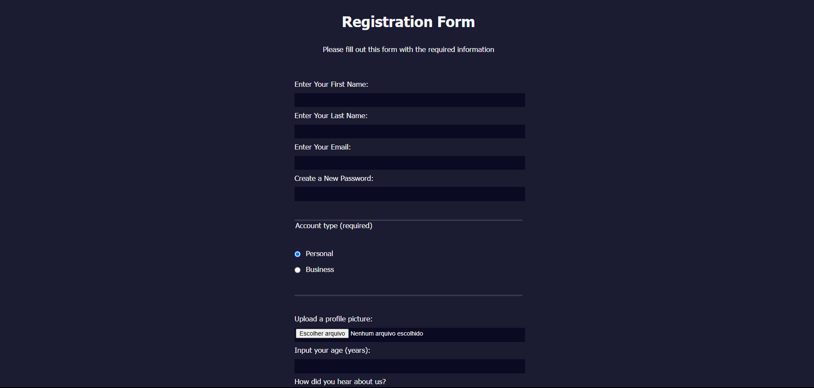

# 📄 form

Welcome to the **Form** repository! This project consists of a simple and responsive contact form, developed with **HTML5** and **CSS3**. The goal is to practice the creation of accessible and visually pleasing forms, essential for user interaction on websites and web applications.

## Layout

    

## 📋 Features

- **Contact Form:** Includes fields for name, email and message, allowing users to get in touch efficiently.

- **Responsive Layout:** Adapts to different screen sizes, ensuring a good experience on mobile devices and desktops.

- **Clean and Intuitive Design:** Uses a soft color palette and legible typography to make it easy to read and navigate.

## 🛠️ Technologies Used

**HTML5**: Semantic structuring of page content.

**CSS3**: Responsive form styling and layout.